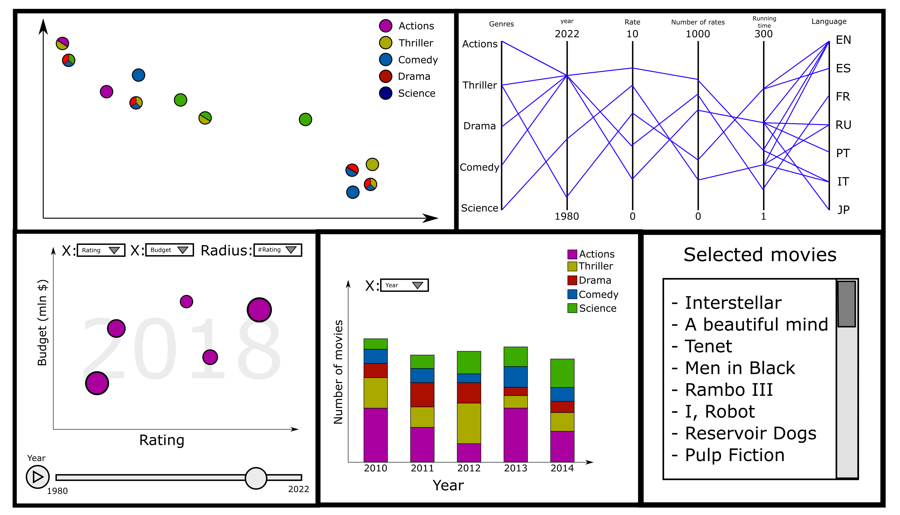

## Visual Analytics Project

### Brief decription

Project for the course visual analytics of engineering in computer science, Sapienza, University of Rome.

The project is a data analyzer for movies

There are 5 parts:

- **A Scatter Plot** representing the MDS result
- **A Parallel coordinates chart** to visualize all attributes of the movies
- **Bubble plot** with interchangeable data for each axis to visualize movies’ data, it’s also possible to select a specific year
- **Column bar** to visualize genres division over different data
- **List of select movies** a list of selected movies by user interaction

You can test the software opening this website [here](https://kernel-machine.github.io/VA_Project/)

### Documentation
- Project report [Report.pdf](https://github.com/kernel-machine/VA_Project/blob/main/report/report.pdf)
- Presentation slides [Slides.pdf](https://github.com/kernel-machine/VA_Project/files/10474585/Visual.Analytics.presentation.pdf)
